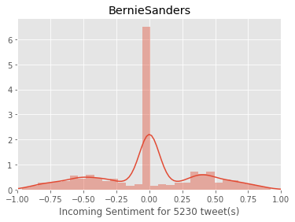
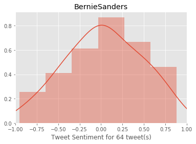
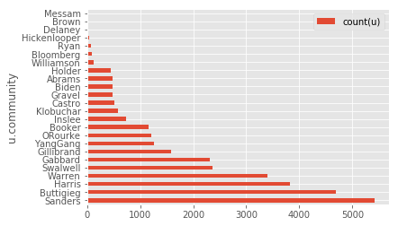
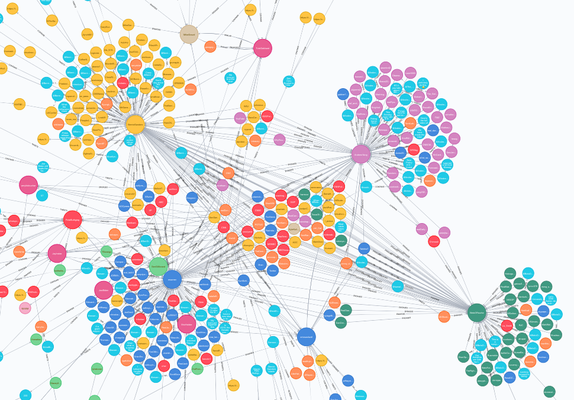
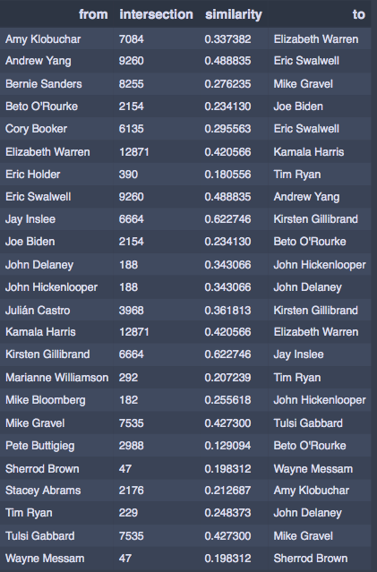
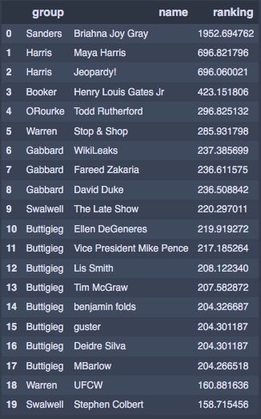

# Primary-Candidate-Analysis
Create, curate and analyze a collection of tweets related to the Democratic primary candidates for the 2020 US Presidential election.

How can we use Twitter to compare candidates and their respective communities?
https://docs.google.com/presentation/d/1Z_Xt5jUyLVo8kEL2X03R-Z8J-rHZIDWdrEYqvcxntho/edit?usp=sharing

## Candidates and Their Accounts
Joe Biden https://twitter.com/JoeBiden  
Bernie Sanders https://twitter.com/BernieSanders  
Kamala Harris https://twitter.com/KamalaHarris  
Cory Booker https://twitter.com/CoryBooker  
Elizabeth Warren https://twitter.com/ewarren  
Beto O’Rourke https://twitter.com/BetoORourke  
Eric Holder https://twitter.com/EricHolder  
Sherrod Brown https://twitter.com/SherrodBrown  
Amy Klobuchar https://twitter.com/amyklobuchar  
Michael Bloomberg https://twitter.com/MikeBloomberg  
John Hickenlooper https://twitter.com/Hickenlooper  
Kirsten Gillibrand https://twitter.com/SenGillibrand  
Andrew Yang https://twitter.com/AndrewYang  
Julián Castro https://twitter.com/JulianCastro  
Eric Swalwell https://twitter.com/ericswalwell  
Tulsi Gabbard https://twitter.com/TulsiGabbard  
Jay Inslee https://twitter.com/JayInslee  
Pete Buttigieg https://twitter.com/PeteButtigieg  
John Delaney https://twitter.com/JohnDelaney  
Mike Gravel https://twitter.com/MikeGravel  
Wayne Messam https://twitter.com/WayneMessam  
Tim Ryan https://twitter.com/TimRyan  
Marianne Willamson https://twitter.com/marwilliamson  
Stacey Abrams https://twitter.com/staceyabrams  

## Sources:
Tweepy Stream Tutorial  
https://www.youtube.com/watch?v=wlnx-7cm4Gg  
Tweets collected based on mentions of Candidate names or tweets sent from the accounts listed above for declared Candidates or likely Candidates.

## Feature Engineering:
* Sentiment Analysis: Using NLTK's VADER approach, found the distribution of sentiment for tweets discussing Candidates and for tweets from the Candidates themselves. Exploration of the data showed that the built in approach had difficulty attributing a positive or negative sentiment to many of the tweets discussing Candidates with large peaks in the distribution at a neutral state. Tweets from the Candidates tended to show less of this behavior and clear differences could be seen in the calculated sentiments. Below is an example result for Candidate Bernie Sanders:  

* Community Detection: The communities around the Candidates were detected using Label Propagation with Neo4J's graph algorithms. The size of the community attributed to each Candidate is shown below as well as an example of the resulting labels in the graph database:  

* Similarity: Comparing Candidate communities was done using Jaccard similarity with Neo4J's graph algorithms. Overlap compared to total community size was computed as a way to describe the pairwise similarity of the demographics of Candidates. Below are the results showing each candidate with their most similar rival:  

* Centrality: Centrality was calculated using page ranking with Neo4J's graph algorithms to determine key members in each community. Below are the results in order of overall ranking (note that the top user discovered is Bernie Sander's national press secretary):  

